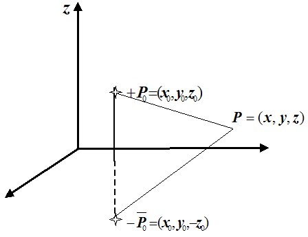
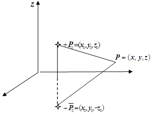

<!--DEBUG-->



## Контрольні запитання до леції №20

### 10. Визначення функції Гріна основних крайових задач для параболічного рівняння. Представлення розв'язку. 

Будемо розглядати граничні задачі для рівняння теплопровідності:

$$
\begin{equation}
	\left\{
		\begin{aligned}
			& a^2 \Delta u(x, t) - \frac{\partial u(x,t)}{\partial t} = - F(x, t), \newline
			& u(x, 0) = u_0(x), \newline
			& \left. \ell_i u(x, t) \right|_{x \in S} = f(x, t), \quad i = 1, 2, 3.
		\end{aligned}
	\right.
\end{equation}
$$

для $$x \in \Omega$$, $$t > 0$$.

Тут 

$$
\begin{align}
	\left. \ell_1 u(x, t) \right|_{x \in S} &= \left. u(x, t) \right|_{x \in S}, \newline
	\left. \ell_2 u(x, t) \right|_{x \in S} &= \left. \frac{\partial u(x, t)}{\partial n} \right|_{x \in S}, \newline
	\left. \ell_3 u(x, t) \right|_{x \in S} &= \left. \frac{\partial u(x, t)}{\partial n} + \alpha(x, t) \cdot u(x, t) \right|_{x \in S}
\end{align}
$$

&mdash; оператори граничних умов першого, другого, або третього роду.

**Визначення** функції Гріна рівняння теплопровідності: Функцію $$E_i (x, \xi, t - \tau)$$ будемо називати _функцією Гріна першої, другої або третьої граничної задачі рівняння теплопровідності_ в області $$\Omega$$ з границею $$S$$ для $$t > 0$$, якщо вона є розв'язком настуної граничної задачі:

$$
\begin{equation}
	\left\{
		\begin{aligned}
			& a^2 \Delta_x E_i (x, \xi, t - \tau) - \frac{\partial E_i(x, \xi, t - \tau)}{\partial t} = - \delta(x - \xi, t - \tau), \newline
			& \left. E_i(x, \xi, t - \tau) \right|_{t - \tau \le 0} = 0, \newline
			& \left. \ell_i E_i (x, \xi, t - \tau) \right|_{x \in S} = 0, \quad i = 1, 2, 3.
		\end{aligned}
	\right.
\end{equation}
$$

для $$x \in \Omega$$, $$t > 0$$.

Еквівалентне визначення можна надати у вигляді: Функцію $$E_i (x, \xi, t - \tau)$$ будемо називати _функцією Гріна першої, другої або третьої граничної задачі рівняння теплопровідності_ в області $$\Omega$$ з границею $$S$$ для $$t > 0$$, якщо вона може бути представлена у вигляді

\begin{equation}
	E_i(x, \xi, t - \tau) = \epsilon(x - \xi, t - \tau) + \omega_i(x, \xi, t - \tau),
\end{equation}

де перший доданок є фундаментальним розв'язком оператора теплопровідності, а другий є розв'язком наступної граничної задачі

$$
\begin{equation}
	\left\{
		\begin{aligned}
			& a^2 \Delta_x \omega_i (x, \xi, t - \tau) - \frac{\partial \omega_i(x, \xi, t - \tau)}{\partial t} = - \delta(x - \xi, t - \tau), \newline
			& \left. \omega_i(x, \xi, t - \tau) \right|_{t - \tau \le 0} = 0, \newline
			& \left. \ell_i \omega_i (x, \xi, t - \tau) \right|_{x \in S} = -\left.\ell_i \epsilon_i(x - \xi, t - \tau)\right|_{x \in S} \quad i = 1, 2, 3.
		\end{aligned}
	\right.
\end{equation}
$$

для $$x \in \Omega$$, $$t > 0$$.

Враховуючи відповідні граничні умови, яким задовольняє розв'язок на границі поверхні $$S$$ отримаємо для першої граничної задачі:

$$
\begin{equation}
	\begin{aligned}
		u(x, t) &= \Int_0^t \Iiint_\Omega E_1(x, \xi, t - \tau) F(\xi, \tau) \diff \xi \diff \tau + \newline
		& \quad + \Iiint_\Omega E_1(x, \xi, t) u_0(\xi) \diff \xi - \newline
		& \quad - a^2 \Int_0^t \Iint_S \left( \frac{\partial E_1(x, \xi, t - \tau)}{\partial n_\xi} f(\xi, \tau)\right) \diff S_\xi \diff \tau.
	\end{aligned}
\end{equation}
$$

Для другої та третьої граничних задач отримаємо 

$$
\begin{equation}
	\begin{aligned}
		u(x, t) &= \Int_0^t \Iiint_\Omega E_i(x, \xi, t - \tau) F(\xi, \tau) \diff \xi \diff \tau + \newline
		& \quad + \Iiint_\Omega E_i(x, \xi, t) u_0(\xi) \diff \xi + \newline
		& \quad + a^2 \Int_0^t \Iint_S E_i(x, \xi, t - \tau) f(\xi, \tau) \diff S_\xi \diff \tau.
	\end{aligned}
\end{equation}
$$

### 11. Визначення функції Гріна основних крайових задач для гіперболічного рівняння. Представлення розв'язку. 

Будемо розглядати граничні задачі для хвильового рівняння:

$$
\begin{equation}
	\left\{
		\begin{aligned}
			& a^2 \Delta u(x, t) - \frac{\partial^2 u(x, t)}{\partial t^2} = -F(x, t), \newline
			& u(x, 0) = u_0(x), \newline
			& \frac{\partial u(x, 0)}{\partial t} = v_0(x), \newline
			& \left. \ell_i u(x, t) \right|_{x \in s} = f(x, t), \quad i = 1, 2, 3.
		\end{aligned}
	\right.
\end{equation}
$$

**Визначення** функції Гріна хвильового рівняння: Функцію $$\Theta_i(x, \xi, t - \tau)$$ будемо називати функцією Гріна першої, другої або третьої граничної задачі хвильового рівняння в області $$\Omega$$ з границею $$S$$ і $$t > 0$$, якщо вона є розв'язком наступної граничної задачі:

$$
\begin{equation}
	\left\{
		\begin{aligned}
			& a^2 \Delta_x \Theta_i(x, \xi, t - \tau) - \frac{\partial^2 \Theta_i(x, \xi, t - \tau)}{\partial t^2} = - \delta(x - \xi) \delta(t - \tau), \newline
			& \left. \Theta_i(x, \xi, t - \tau) \right|_{t - \tau \le 0} = 0, \newline
			& \left. \frac{\partial \Theta_i(x, \xi, t - \tau)}{\partial t} \right|_{t - \tau \le 0} = 0, \newline
			& \left. \ell_i \Theta_i(x, \xi, t - \tau) \right|_{x \in S} = 0, \quad i = 1, 2, 3.
		\end{aligned}
	\right.
\end{equation}
$$

Еквівалентне визначення можна надати у вигляді: Функцію $$\Theta_i(x, \xi, t - \tau)$$ будемо називати функцією Гріна першої, другої або третьої граничної задачі хвильового рівняння в області $$\Omega$$ з границею $$S$$ і $$t > 0$$, якщо вона може бути представлена у вигляді

\begin{equation}
	\Theta_i(x, \xi, t - \tau) = \psi(x - \xi, t - \tau) + \theta_i(x, \xi, t - \tau),
\end{equation}

де перший доданок є фундаментальним розв'язком хвильового оператора, а другий є розв'язком наступної граничної задачі:

$$
\begin{equation}
	\left\{
		\begin{aligned}
			& a^2 \Delta_x \theta_i(x, \xi, t - \tau) - \frac{\partial^2 \theta_i(x, \xi, t - \tau)}{\partial t^2} = 0, \newline
			& \left. \theta_i(x, \xi, t - \tau) \right|_{t - \tau \le 0} = 0, \newline
			& \left. \frac{\partial \theta_i(x, \xi, t - \tau)}{\partial t} \right|_{t - \tau \le 0} = 0, \newline
			& \left. \ell_i \theta_i(x, \xi, t - \tau) \right|_{x \in S} = - \left. \ell_i \psi_i(x, \xi, t - \tau) \right|_{x \in S}, \quad i = 1, 2, 3.
		\end{aligned}
	\right.
\end{equation}
$$

Розв'язком першої граничної задачі для хвильового рівняння є 

$$
\begin{equation}
	\begin{aligned}
		u(x, t) &= \Int_0^t \Iiint_\Omega \Theta_1(x, \xi, t - \tau) F(\xi, \tau) \diff \xi \diff \tau + \newline
		& \quad + \Iiint_\Omega \Theta_1(x, \xi, t) v_0(\xi), \diff \xi - \newline
		& \quad - \Iiint_\Omega \left. \frac{\partial \Theta_1(x, \xi, t - \tau)}{\partial \tau} \right|_{\tau = 0} u(\xi) \diff \xi - \newline
		& \quad - a^2 \Int_0^t \Iint_S \left( \frac{\partial \Theta_1(x, \xi, t - \tau)}{\partial n_\xi} f(\xi, \tau) \right) \diff S_\xi \diff \tau.
	\end{aligned}
\end{equation}
$$

Розв'язком другої і третьої граничних задач для хвильового рівняння є 

$$
\begin{equation}
	\begin{aligned}
		u(x, t) &= \Int_0^t \Iiint_\Omega \Theta_i(x, \xi, t - \tau) F(\xi, \tau) \diff \xi \diff \tau + \newline
		& \quad + \Iiint_\Omega \Theta_i(x, \xi, t) v_0(\xi), \diff \xi - \newline
		& \quad - \Iiint_\Omega \left. \frac{\partial \Theta_1(x, \xi, t - \tau)}{\partial \tau} \right|_{\tau = 0} u(\xi) \diff \xi - \newline
		& \quad - a^2 \Int_0^t \Iint_S \Big( \Theta_i(x, \xi, t - \tau) f(\xi, \tau) \Big) \diff S_\xi \diff \tau.
	\end{aligned}
\end{equation}
$$

### 30. Методи побудови функції Гріна для оператора Лапласа, на прикладі задачі Діріхле для півпростору.

Розглянемо граничну задачу:

$$
\begin{equation}
	\left\{
		\begin{aligned}
			& \Delta U(P) = - F(P), \quad P \in \Omega = \{(x, y, z): z > 0, x, y \in \RR\}, \newline
			& \left. U(P) \right|_{P \in S} = f(P), \quad S = \{(x, y, z): z = 0, x, y \in \RR\}.
		\end{aligned}
	\right.
\end{equation}
$$

Для знаходження розв'язку цієї задачі побудуємо функцію Гріна першої граничної задачі оператора Лапласа у півпросторі $$z > 0$$.

В довільній точці $$P_0$$ верхнього півпростору розташуємо одиничний точковий заряд, потенціал якого обчислюється

\begin{equation}
	\frac{1}{4 \pi |P - P_0|},
\end{equation}

в нижньому півпросторі $$z < 0$$, розташуємо компенсуючи заряди, так що би в кожній точці поверхні (площини $$z = 0$$) сумарний потенціал електростатичного поля дорівнював нулю:

Користуючись принципом суперпозиції електростатичних полів, легко зрозуміти, що компенсація потенціалу заряду в точці $$P_0$$ відбудеться у випадку, коли компенсуючий заряд розташувати дзеркально існуючому відносно площини $$z = 0$$, а величину заряду обрати одиничну зі знаком мінус.

В результаті отримаємо сумарний потенціал електростатичного поля:

$$
\begin{equation}
	\begin{aligned}
		\Pi(P) &= \frac{1}{4 \pi \sqrt{(x - x_0)^2 + (y - y_0)^2 + (z - z_0)^2}} - \newline
		& \quad - \frac{1}{4 \pi \sqrt{(x - x_0)^2 + (y - y_0)^2 + (z + z_0)^2}}.
	\end{aligned}
\end{equation}
$$

<!-- Легко перевірити, що 
\begin{equation}
	\left. \Pi(P) \right|_{P \in S} = 0.
\end{equation} -->

Таким чином побудована функція представляє собою функцію Гріна першої граничної задачі (Діріхле) оператора Лапласа для півпростору:

$$
\begin{equation}
	\begin{aligned}
		G_1(P, P_0) &= \dfrac{1}{4 \pi \sqrt{(x - x_0)^2 + (y - y_0)^2 + (z - z_0)^2}} - \newline
		& \quad - \dfrac{1}{4 \pi \sqrt{(x - x_0)^2 + (y - y_0)^2 + (z + z_0)^2}}.
	\end{aligned}
\end{equation}
$$

Для знаходження розв'язку задачі Діріхле скористаємося формулою інтегрального представлення:

$$
\begin{equation}
	U(P_0) = \Iiint_\Omega G_1(P, P_0) F(P) \diff P - \Iint_S \frac{\partial G_1(P, P_0)}{\partial n_P} f(P) \diff S_P.
\end{equation}
$$

<!-- Обчислимо
\begin{equation}
	\begin{aligned}
		\left. \frac{\partial G_1(P, P_0)}{\partial n_P} \right|_{P \in S} &= - \frac{\partial}{\partial z} \left( \frac{1}{4 \pi \sqrt{(x - x_0)^2 + (y - y_0)^2 + (z - z_0)^2}} \right.- \\
		& \quad - \left. \frac{1}{4 \pi \sqrt{(x - x_0)^2 + (y - y_0)^2 + (z + z_0)^2}} \right) = \\
		& = - \left( \frac{z - z_0}{4 \pi ((x - x_0)^2 + (y - y_0)^2 + (z - z_0)^2)^{3/2}} \right. - \\
		& \quad - \left. \left. \frac{z - z_0}{4 \pi ((x - x_0)^2 + (y - y_0)^2 + (z + z_0)^2)^{3/2}} \right) \right|_{z = 0} = \\
		& = \frac{-z_0}{2 \pi (x - x_0)^2 + (y - y_0)^2 + z_0^2)^{3 / 2}}.
	\end{aligned}
\end{equation} -->

<!-- Таким чином, використовуючи формулу \eqref{eq:4.3.46} інтегрального представлення розв'язку першої граничної задачі,  -->

Можемо записати розв'язок задачі Діріхле для рівняння Пуассона:

$$
\begin{equation}
	\begin{aligned}
		U(x_0, y_0, z_0) &= \frac{1}{4 \pi} \Int_0^\infty \Iint_{\RR^2} \left( \frac{1}{\sqrt{(x - x_0)^2 + (y - y_0)^2 + (z - z_0)^2}} \right. - \newline
		& \quad - \left. \frac{1}{\sqrt{(x - x_0)^2 + (y - y_0)^2 + (z + z_0)^2}} \right) F(x, y, z) \diff x \diff y \diff z + \newline
		& \quad + \frac{z_0}{2 \pi} \Int_{-\infty}^\infty \Int_{-\infty}^\infty \frac{f(x, y) \diff x \diff y}{((x - x_0)^2 + (y - y_0)^2 + z_0^2)^{3/2}}
	\end{aligned}
\end{equation}
$$

### 31. Методи побудови функції Гріна для оператора Лапласа, на прикладі задачі Неймана для півпростору.

Будемо розглядати граничну задачу:

$$
\begin{equation}
	\left\{
		\begin{aligned}
			& \Delta U(P) = - F(P), \quad P \in \Omega = \{(x, y, z): z > 0, x, y \in \RR\}, \newline
			& - \left. \frac{\partial U(P)}{\partial z} \right|_{P \in S} = f(P), \quad S = \{(x, y, z): z = 0, x, y \in \RR\}.
		\end{aligned}
	\right.
\end{equation}
$$

Для знаходження розв'язку цієї задачі побудуємо функцію Гріна другої граничної задачі оператора Лапласа для півпростору.

Для випадку умови другого роду тобто коли на площині $$z = 0$$ виконується умова

\begin{equation}
	\left. \frac{\partial G_2(P, P_0)}{\partial n_P} \right|_{P \in S} = 0,
\end{equation}

її можна інтерпретувати як рівність нулю потоку електростатичного поля крізь площину $$z = 0$$.

Це означає, що поле внутрішнього одиничного заряду треба компенсувати полем зовнішніх зарядів. Це можна зробити, якщо дзеркально одиничному позитивному заряду в точці $$P_0$$ розташувати заряд додатного знаку в симетричній точці $$\overline{P_0}$$:

Таким чином сумарний потенціал двох зарядів, а значить і функцію Гріна можна записати у вигляді:

$$
\begin{equation}
	\begin{aligned}
		\Pi(P) &= \frac{1}{4 \pi \sqrt{(x - x_0)^2 + (y - y_0)^2 + (z - z_0)^2}} + \newline
		& \quad + \frac{1}{4 \pi \sqrt{(x - x_0)^2 + (y - y_0)^2 + (z + z_0)^2}} = G_2(P, P_0).
	\end{aligned}
\end{equation}
$$

<!-- Перевіримо, що побудована функція Гріна задовольняє граничній умові:
\begin{equation}
	\begin{aligned}
		\left. \frac{\partial G_2(P, P_0)}{\partial n_P} \right|_{P \in S} &= - \frac{\partial}{\partial z} \frac{1}{4 \pi} \left( \frac{1}{\sqrt{(x - x_0)^2 + (y - y_0)^2 + (z - z_0)^2}} \right. + \\
		& \quad + \left. \left. \frac{1}{\sqrt{(x - x_0)^2 + (y - y_0)^2 + (z + z_0)^2}} \right) \right|_{z = 0} = \\
		& = \frac{1}{4 \pi} \left( \frac{z - z_0}{((x - x_0)^2 + (y - y_0)^2 + (z - z_0)^2)^{3/2}} \right. + \\
		& \quad + \left. \left. \frac{z + z_0}{((x - x_0)^2 + (y - y_0)^2 + (z + z_0)^2)^{3/2}} \right) \right|_{z = 0} = 0.
	\end{aligned}
\end{equation} -->

<!-- Враховуючи формулу \eqref{eq:4.3.47} інтегрального представлення розв'язку другої граничної задачі,  -->

Отримаємо формулу для розв'язку задачі Неймана рівняння Пуассона в півпросторі:

$$
\begin{equation}
	\begin{aligned}
		U(x_0, y_0, z_0) &= \frac{1}{4 \pi} \Int_0^\infty \Iint_{\RR^2} \left( \frac{1}{\sqrt{(x - x_0)^2 + (y - y_0)^2 + (z - z_0)^2}} \right. + \newline
		& \quad + \left. \frac{1}{\sqrt{(x - x_0)^2 + (y - y_0)^2 + (z + z_0)^2}} \right) F(x, y, z) \diff x \diff y \diff z + \newline
		& \quad + \frac{1}{2 \pi} \Int_{-\infty}^\infty \Int_{-\infty}^\infty \frac{f(x, y) \diff x \diff y}{((x - x_0)^2 + (y - y_0)^2 + z_0^2)^{3/2}}.
	\end{aligned}
\end{equation}
$$
