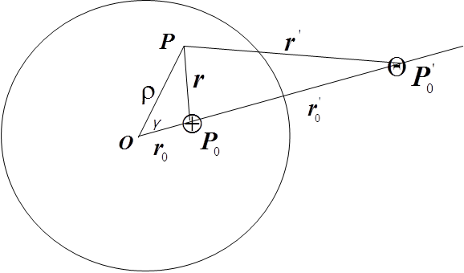

<!--DEBUG-->



## Контрольні запитання до леції №21

### 18. Визначення гармонічної функції та її приклади.

Функцію $$u(x)$$ називають _гармонічною в деякій відкритій області_ $$\Omega$$, якщо $$u \in C^{(2)}(\Omega)$$ і $$\Delta u(x) = 0$$, $$x \in \Omega$$, тобто функція є двічі неперервно диференційованим розв'язком рівняння Лапласа.

Функцію $$u(x)$$ називають _гармонічною в деякій точці_, якщо ця функція гармонічна в деякому околі цієї точки.

Функцію $$u(x)$$ називають _гармонічною в деякій замкненій області_, якщо вона гармонічна в деякій більш широкій відкритій області.

З гармонічними функціями у тривимірних і двовимірних областях ми вже зустрічалися, а саме нам відомо, що 

\begin{equation}
	\Delta \frac{1}{2 \pi} \ln \frac{1}{|x - \xi|} = 0, \quad x \ne \xi, \quad x, \xi \in \RR^2,
\end{equation}

і

\begin{equation}
	\Delta \frac{1}{4 \pi |x - \xi|} = 0, \quad x \ne \xi, \quad x, \xi \in \RR^3.
\end{equation}

### 21. Інтегральне представлення функцій класу $$C^2(\Omega)$$ та гармонічних функцій.

Для отримання інтегрального представлення функцій класу $$C^2(\Omega)$$ будемо використовувати другу формулу Гріна для оператора Лапласа:

\begin{equation}
	\begin{aligned}
		& \Iiint_\Omega ( v(x) \Delta u(x) - u(x) \Delta v(x) ) \diff x = \newline
		& \quad = \Iint_S \left( v(x) \cdot \frac{\partial u(x)}{\partial n} - u(x) \cdot \frac{\partial v(x)}{\partial n} \right) \diff S.
	\end{aligned}
\end{equation}

В якості функції $$u(\xi)$$ оберемо довільну функцію $$C^2(\Omega)$$, а у якості $$v$$, фундаментальний розв'язок оператора Лапласа для тривимірного евклідового простору $$\frac{1}{4 \pi \vert x - \xi \vert}$$.

В результаті підстановки цих величин в останню формулу отримаємо

\begin{equation}
	\begin{aligned}
		& \Iiint_\Omega \left( \frac{1}{4 \pi |x - \xi|} \Delta u(\xi) - u(\xi) \delta (x - \xi) \right) \diff \xi = \newline
		&\quad = \Iint_S \left( \frac{1}{4 \pi |x - \xi|} \cdot \frac{\partial u(\xi)}{\partial n} - u(\xi) \cdot \frac{\partial}{\partial n} \frac{1}{4 \pi |x - \xi|} \right) \diff S_\xi.
	\end{aligned}
\end{equation}

Після обчислення другого доданку в лівій частині можемо записати формулу інтегрального представлення функцій класу $$C^2(\Omega)$$.

\begin{equation}
	\begin{aligned}
		u(x) &= - \Iiint_\Omega \frac{1}{4 \pi |x - \xi|} \Delta u(\xi) \diff \xi + \newline
		&\quad + \Iint_S \left( \frac{1}{4 \pi |x - \xi|} \cdot \frac{\partial u(\xi)}{\partial n} - u(\xi) \cdot \frac{\partial n}{\partial n} \frac{1}{4 \pi |x - \xi|} \right) \diff S_\xi.
	\end{aligned}
\end{equation}

У випадку коли функція $$u(x)$$ є гармонічною в області $$\Omega$$ то остання формула прийме вигляд:

\begin{equation}
	u(x) = \Iint_S \left( \frac{1}{4 \pi |x - \xi|} \cdot \frac{\partial u(\xi)}{\partial n} - u(\xi) \cdot \frac{\partial}{\partial n} \frac{1}{4 \pi |x - \xi|} \right) \diff S_\xi.
\end{equation}

### 22. Теорема про середнє значення гармонічної функції.

**Теорема** (_про середнє значення гармонічної функції_). Якщо $$u(x)$$ &mdash; гармонічна функція в кулі і неперервна в замиканні цієї кулі, то значення гармонічної функції в центрі кулі дорівнює середньому арифметичному її значень на сфері, що обмежує кулю.

_Доведення._ Використаємо формулу

\begin{equation}
	u(x) = \Iint_S \left( \frac{1}{4 \pi |x - \xi|} \cdot \frac{\partial u(\xi)}{\partial n} - u(\xi) \cdot \frac{\partial}{\partial n} \frac{1}{4 \pi |x - \xi|} \right) \diff S_\xi.
\end{equation}

в якій в якості поверхні $$S$$ візьмемо сферу радіусу $$R$$ з центром у точці $$x_0$$, і обчислимо значення функції $$u$$ в точці $$x_0$$:

\begin{equation}
	u(x_0) = \Iint_{S(x_0, R)} \left( \frac{1}{4 \pi |x_0 - \xi|} \cdot \frac{\partial u(\xi)}{\partial n} - u(\xi) \cdot \frac{\partial}{\partial n_\xi} \frac{1}{4 \pi |x_0 - \xi|} \right) \diff S_\xi.
\end{equation}
 
Оскільки $$\xi \in S(x_0, R)$$, то $$\frac{1}{4 \pi \vert x_0 - \xi \vert} = \frac{1}{4 \pi R}$$, а

\begin{equation}
	\left. \frac{\partial}{\partial n_\xi} \frac{1}{4 \pi |x_0 - \xi|} \right|_{S(x_0, R)} = \frac{1}{4 \pi R^2}.
\end{equation}

Таким чином 

\begin{equation}
	u(x_0) = \frac{1}{4 \pi R} \Iint_{S(x_0, R)} \frac{\partial u(\xi)}{\partial n} \diff S_\xi + \frac{1}{4 \pi R^2} \Iint_{S(x_0, R)} u(\xi) \diff S_\xi.
\end{equation}

Оскільки перший інтеграл дорівнює нулю, то остаточно маємо

\begin{equation}
	u(x_0) = \frac{1}{4 \pi R^2} \Iint_{S(x_0, R)} u(\xi) \diff S_\xi 
\end{equation}

### 32. Методи побудови функції Гріна для оператора Лапласа, на прикладі задачі Діріхле для кулі.

Будемо розглядати граничну задачу

$$
\begin{equation}
	\left\{
		\begin{aligned}
			& \Delta U(P) = 0, \quad |P| < R, \newline
			& \left. U(P) \right|_{|P| = R} = f(P).
		\end{aligned}
	\right.
\end{equation}
$$

Побудуємо функцію Гріна першої граничної задачі оператора Лапласа для кулі. Введемо позначення:

\begin{equation}
	| OP_0 | = r_0, \quad | OP_0' | = r_0', \quad r = | P - P_0 |, \quad r' = | P - P_0' |.
\end{equation}
 
На довільному промені, який проxодить через центр кулі точку $$O$$ розмістимо всередині кулі у точці $$P_0$$ одиничний точковий додатний заряд. Розглянемо точку $$P_0'$$ симетричну точці   відносно сфери.

Це означає, що обидві точки лежать на одному промені, а їx відстані від центру сфери задовольняють співвідношенню

\begin{equation}
	r_0 \cdot r_0' = R^2.
\end{equation}

В точці $$P_0'$$ розмістимо від'ємний заряд величини $$e = R / r_0$$. 

Функцію Гріна задачі Діріxле для кулі можна записати:

\begin{equation}
	G_1 (P, P_0) = \frac{1}{4\pi} \left( 1 / \sqrt{\rho^2 + r_0^2 - 2 \rho r_0 \cos \gamma} - 1 / \sqrt{R^2 + \frac{\rho^2 r_0^2}{R^2} - 2 \rho r_0 \cos \gamma} \right).
\end{equation}

<!-- Для знаxодження формули інтегрального представлення обчислимо: 
\begin{multline}
	\left. \frac{\partial G_1 (P, P_0)}{\partial n_P} \right|_{P \in S} = \left. \frac{\partial G_1 (P, P_0)}{\partial \rho} \right|_{\rho = R} = \\
	= \frac{1}{4 \pi} \left. \left( - \frac{\rho - r_0 \cos \gamma}{(\rho^2 + r_0^2 - 2 \rho r_0 \cos \gamma)^{3/2}} + \frac{\frac{\rho r_0^2}{R^2} - r_0 \cos \gamma}{\left(\frac{\rho^2 r_0^2}{R^2} + r_0^2 - 2 R r_0 \cos \gamma\right)^{3/2}} \right) \right|_{\rho = R} = \\
	= - \frac{1}{4 \pi R} \cdot \frac{R^2 - r_0^2}{(R^2 + r_0^2 - 2 R r_0 \cos \gamma)^{3/2}}.
\end{multline}

Для запису остаточної формули треба ввести сферичну систему координат. Запишемо через сферичні кути:
\begin{equation}
	\cos \gamma = \frac{\measuredangle (OP, OP_0)}{\rho r_0} = \cos \theta \cos \theta_0 + \sin \theta \sin \theta_0 \cos (\phi - \phi_0).
\end{equation}

Тут $\rho, \phi, \theta$ --- сферичні координати точки $P$, а $r_0, \phi_0, \theta_0$ --- сферичні координати точки $P_0$. \medskip -->

Формула Пуассона для кулі дає розв'язок задачі Діріxле для рывняння Лапласа у такому вигляді:

\begin{equation}
	U(r_0, \phi_0, \theta_0) = \frac{R}{4 \pi} \Int_0^{2 \pi} \Int_0^\pi \frac{(R^2 - r_0^2) \sin \theta f(\phi, \theta) \diff \theta \diff \phi}{(R^2 + r_0^2 - 2 R r_0 \cos \gamma)^{3/2}}.
\end{equation}

### 33. Функція Гріна першої та другої граничної задачі рівняння теплопровідності для півпрямої.

Ми покажемо, як за допомогою функції Гріна можна знайти розв'язок першої та другої граничних задач рівняння теплопровідності для напівпрямої $$x > 0$$. Нехай ми розглядаємо граничні задачі:

$$
\begin{equation}
	\left\{
		\begin{aligned}
			& a^2 \cdot \frac{\partial^2 u(x, t)}{\partial x^2} - \frac{\partial u(x, t)}{\partial t} = -f(x, t), \label{eq:4.20} \newline
			& u(0, t) = \varphi (t), \newline
			& u(x, 0) = u_0 (x),
		\end{aligned}
	\right.
\end{equation}
$$

і

$$
\begin{equation}
	\left\{
		\begin{aligned}
			& a^2 \cdot \frac{\partial^2 u(x, t)}{\partial x^2} - \frac{\partial u(x, t)}{\partial t} = -f(x, t), \label{eq:4.21} \newline
			& \frac{\partial u(0, t)}{\partial x} = \varphi (t), \newline
			& u(x, 0) = u_0 (x).
		\end{aligned}
	\right.
\end{equation}
$$
 
Для побудови функції Гріна використаємо фундаментальний розв'язок оператора теплопровідності в одновимірному евклідовому просторі. Як відомо від має вигляд:

$$
\begin{equation}
	\varepsilon (x, t) = \frac{\theta(t)}{2 a \sqrt{\pi t}} \cdot \exp\left\{-\frac{|x|^2}{2a^2 t}\right\}.
\end{equation}
$$

Оскільки при побудові функції Гріна використовується фізична інтерпретація фундаментального розв'язку, то з'ясуємо її знайшовши розв'язок наступної задачі:

> В нескінченому стрижні з теплоізольованою боковою поверхнею і нульовою початковою температурою в початковий момент часу в точці $$x = 0$$ миттєво виділилося $$Q$$ одиниць тепла. Необхідно визначити температуру стрижня в довільний момент часу в довільній його точці.

<!-- **Розв'язання:**

Запишемо математичну постановку задачі.

Розповсюдження тепла у однорідному стрижні задається рівнянням
теплопровідності з постійними коефіцієнтами:

\begin{equation}
	a^2 \frac{\partial ^2 u(x, t)}{\partial x^2} - \frac{\partial u(x, t)}{\partial t} = - \frac{f(x, t)}{c \rho S}, 
\end{equation} 

де $$t > 0$$, $$-\infty < x < \infty$$, $$a^2 = \frac{k}{c\rho}$$, $$f(x, t)$$ &mdash; потужність теплових джерел.

За умовою задачі теплове джерело є таким, що виділяє миттєво $$Q$$ одиниць тепла в точці $$x = 0$$ в початковий момент часу, тому функція $$f(x, t) = Q \delta(t) \delta(x)$$. Тобто сумарна кількість тепла дорівнює 

\begin{equation}
	\Int_{-\infty}^\infty \Int_{-\infty}^\infty Q \delta(t) \delta(x) \diff x \diff t = Q.
\end{equation}

Оскільки до моменту дії теплових джерел початкова температура дорівнювала нулю, то початкова умова повинна мати вигляд: $$u(x, 0) = 0$$.

Таким чином ми маємо задачу Коші для рівняння теплопровідності з однорідною початковою умовою.

Розв'язок такої задачі (температуру стрижня в точці $$x$$ в момент часу $$t$$) можна записати за формулою: 

\begin{equation}
    u(x, t) = \Int_0^t \Iiint_{\RR_n} F(\xi, \tau) \varepsilon(x - \xi, t - \tau) \diff \xi \diff \tau  + \Iiint_{\RR_n} \varepsilon(x - \xi, t - \tau) u_0 (\xi) \diff \xi.
\end{equation}

Використовуючи її для цієї задачі будемо мати:

\begin{equation}
	\begin{aligned}
    u(x, t) &= \Int_0^{t} \Int_{-\infty}^\infty \frac{Q}{c\rho S} \delta(\tau) \delta(\xi) \varepsilon(x - \xi, t - \tau) \diff \xi \diff \tau = \newline
    &= \frac{Q}{c\rho S} \varepsilon(x, t) = \frac{Q}{c\rho S} \cdot \frac{1}{2a\sqrt{\pi t}} \cdot \exp\left\{-\frac{|x|^2}{2a^2 t}\right\}.
    \end{aligned}
\end{equation} -->
 
<!-- Таким чином,  -->

Фундаментальний розв'язок оператора теплопровідності представляє собою функцію, що моделює температуру стрижня в точці $$x$$ в момент часу $$t$$ за рахунок дії миттєвого точкового джерела інтенсивності $$Q = c \rho S$$, яке діє в початковий момент часу в точці $$x = 0$$.

Для побудови функції Гріна граничних задач $$(17)$$, $$(18)$$ на півпрямій використаємо метод відображення теплових джерел.

Якщо на прямій розташувати в довільній точці $$\xi$$ миттєве точкове джерело, яке діє в момент часу $$\tau$$ інтенсивності $$c \rho S$$, а симетричній точці $$-\xi$$ миттєве точкове джерело, яке діє в момент часу $$\tau$$ і має інтенсивність $$-c \rho S$$, то з фізичних міркувань можна очікувати, що в точці $$x = 0$$, яка лежить посередині між точками $$x = \xi$$ та $$x = -\xi$$, вплив теплових джерел дає нульову температуру. Дійсно, виходячи з фізичного змісту фундаментального розв'язку, отримаємо, що температура від дії двох точкових джерел дорівнює
 
$$
\begin{equation}
	\begin{aligned}
		E_1(x, \xi, t - \tau) &= \frac{\theta(t - \tau)}{2 a \sqrt{t - \tau}} \cdot \exp\left\{- \frac{|x - \xi|^2}{2 a^2 (t - \tau)}\right\} - \newline
		&\quad -\frac{\theta(t-\tau)}{2a\sqrt{t-\tau}} \cdot \exp\left\{-\frac{|x + \xi|^2}{2a^2 (t-\tau)}\right\}.
	\end{aligned}
\end{equation}
$$

Легко перевірити, що $$E_1 (0, \xi, t - \tau ) = 0$$, $$\left. E_1 (x, \xi, t - \tau) \right\vert_{t-\tau < 0} = 0$$, а другий додаток задовольняє однорідному рівнянню теплопровідності при $$x > 0$$, $$t - \tau > 0$$. Таким чином $$E_1(x, \xi, t - \tau)$$ є функція Гріна першої граничної задачі рівняння теплопровідності для півпрямої. 
 
Якщо на прямій розташувати в довільній точці $$\xi$$ миттєве точкове джерело, яке діє в момент часу $$\tau$$ інтенсивності $$c\rho S$$, а симетричній точці $$-\xi$$ миттєве точкове джерело, яке діє в момент часу $$\tau$$ і має інтенсивність $$-c\rho S$$, то з фізичних міркувань можна очікувати, що в точці $$x = 0$$, яка лежить посередині між точками $$x = - \xi$$ та $$x = \xi$$, тепловий потік буде дорівнювати нулю.

Запишемо температуру в цьому випадку:

$$
\begin{equation}
	\begin{aligned}
		E_2(x, \xi, t- \tau) &= \frac{\theta(t-\tau)}{2a\sqrt{t-\tau}} \cdot \exp\left\{-\frac{|x - \xi|^2}{2a^2 (t-\tau)}\right\} + \newline
		&\quad + \frac{\theta(t-\tau)}{2a\sqrt{t-\tau}} \cdot \exp\left\{\frac{|x + \xi|^2}{2a^2 (t-\tau)}\right\}.
   	\end{aligned}
\end{equation}
$$

Легко перевірити, що $$\left. \frac{\partial E_2(x, \xi, t)}{\partial x} \right\vert_{x = 0} = 0$$.

Таким чином $$E_2(x, \xi, t - \tau)$$ є функцією Гріна другої граничної задачі рівняння теплопровідності для півпрямої.

Для першої граничної задачі будемо мати:

$$
\begin{equation}
	\begin{aligned}
    	u(x, t) &= \Int_0^t \Int_0^\infty E_1(x, \xi, t - \tau) f(\xi, \tau) \diff \xi \diff \tau + \newline
    	&\quad + \Int_0^\infty E_1(x, \xi, \tau) u_0 (\xi) \diff \xi + \newline
    	&\quad + a^2 \Int_0^t \left( \left. \frac{\partial E_1(x, \xi, t - \tau)}{\partial n_\xi} \right\vert_{\xi = 0} \varphi_0 (\tau) \right) \diff \tau.
    \end{aligned}
\end{equation}
$$

Для другої граничної задачі отримаємо 

$$
\begin{equation}
	\begin{aligned}
    	u(x, t) &= \Int_0^t \Int_0^\infty E_2(x, \xi, t - \tau) f(\xi, \tau) \diff \xi \diff \tau + \newline
    	&\quad + \Int_0^\infty E_2(x, \xi, \tau) u_0 (\xi) \diff \xi - \newline
    	&\quad - a^2 \Int_0^t E_2(x, 0, t - \tau) \varphi(\tau) \diff \tau.
    \end{aligned}
\end{equation}
$$

Продемонстрований метод це лише один з прийомів, який використовується для побудови функції Гріна. 

<!-- Також метод відображення дозволяє будувати функції Гріна для одновимірного хвильового рівняння. -->
