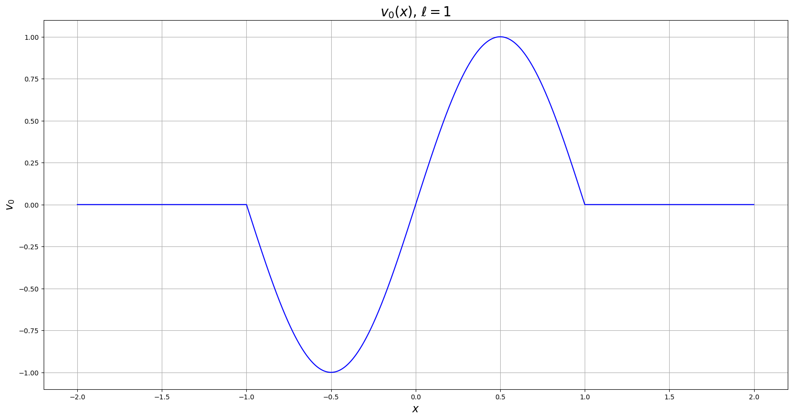
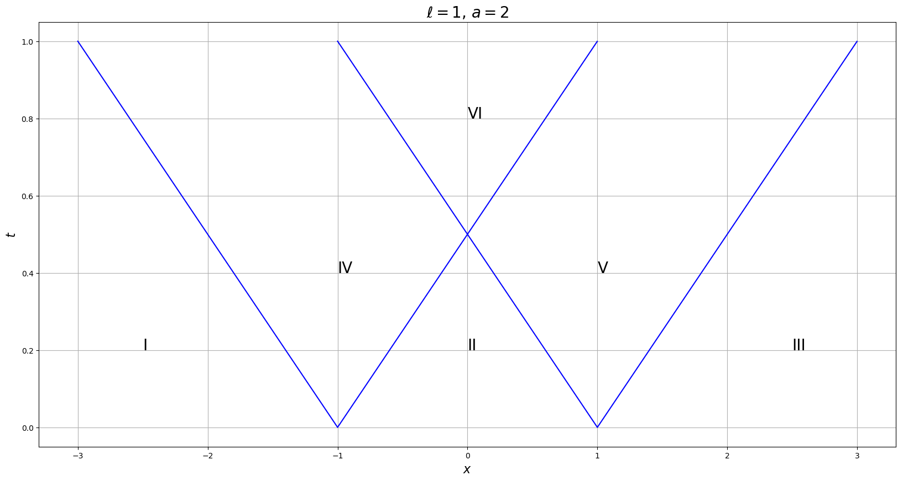
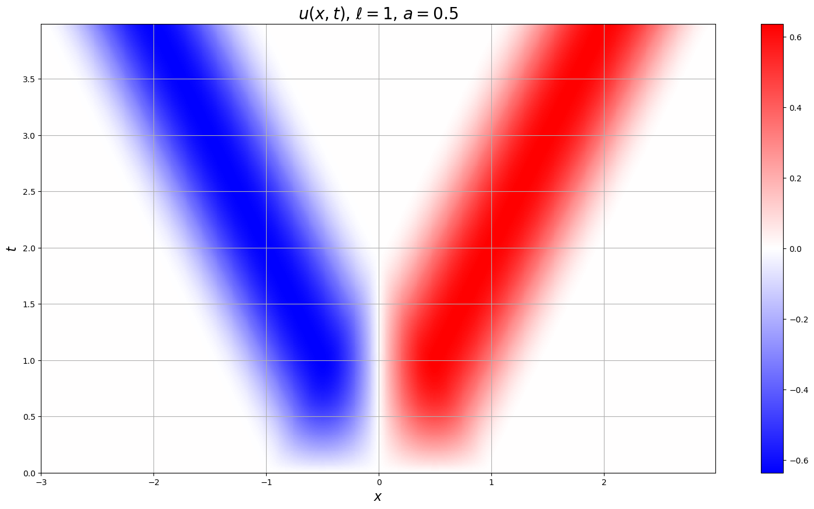
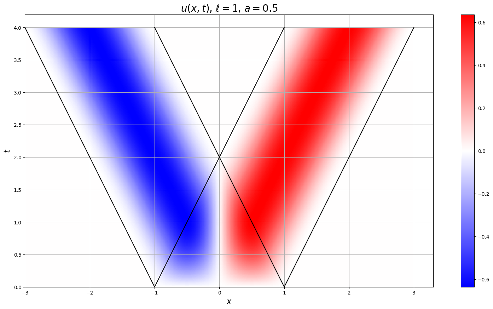



## Третя практична контрольна робота другого семестру

Приклади можливих завдань:

<!-- ### Варіант 1 -->

#### Задача 1

> Знайти розв'язок задачі про коливання кільцевої мембрани $$r_1 \le r \le r_2$$, $$0 \le \varphi \le 2 \pi$$ із закріпленим внутрішнім краєм та вільним зовнішнім краєм під дією стаціонарної радіально-симетричної зовнішньої сили, якщо початкова швидкість дорівнює нулю, а початкові зміщення задані у вигляді функції, що залежить лише від радіусу.

<!-- #### Розв'язок:

Нагадаємо собі загальну постановку задачі Коші для рівняння коливання мембрани: 

$$
\begin{equation}
	\left\{
		\begin{aligned}
			& \frac{\partial^2 u(r, \varphi, t)}{\partial t^2} = \frac{1}{r} \cdot \frac{\partial}{\partial r} \left( r \cdot \frac{\partial u(r, \varphi, t)}{\partial r} \right) + \frac{1}{r^2} \cdot \frac{\partial^2 u(r, \varphi, t)}{\partial \varphi^2} + f(r, \varphi, t), \newline
			& \ell_i u \vert_{r = r_1} = \ell_j u \vert_{r = r_2} = 0, \newline
			& u(r, \varphi, 0) = u_0(r, \varphi), \newline
			& u_t(r, \varphi, 0) = v_0(r, \varphi).
		\end{aligned}	
	\right.
\end{equation}
$$

У нашій задачі:

- внутрішній край _закріплений_, тобто $$i = 1$$ і $$\ell_i u = \ell_1 u = u$$;

- зовнішній край _вільний_, тобто $$j = 2$$ і $$\ell_j u = \ell_2 u = u_r$$;

- зовнішня сила _стаціонарна_, тобто не залежить від часу, $$f(r, \varphi, t) = f(r, \varphi)$$; 

- зовнішня сила _радіально-симетрична_, тобто не залежить від полярного кута, $$f(r, \varphi) = f(r)$$;

- початкова швидкість дорівнює нулю, тобто $$v_0(r, \varphi) \equiv 0$$;

- початкові зміщення задані у вигляді функції, що залежить лише від радіусу, тобто $$u_0(r, \varphi) = u_0(r)$$.

Підставимо усі ці зауваження у систему:

$$
\begin{equation}
	\left\{
		\begin{aligned}
			& \frac{\partial^2 u(r, \varphi, t)}{\partial t^2} = \frac{1}{r} \cdot \frac{\partial}{\partial r} \left( r \cdot \frac{\partial u(r, \varphi, t)}{\partial r} \right) + \frac{1}{r^2} \cdot \frac{\partial^2 u(r, \varphi, t)}{\partial \varphi^2} + f(r), \newline
			& u \vert_{r = r_1}  = u_r \vert_{r = r_2} = 0, \newline
			& u(r, \varphi, 0) = u_0(r), \newline
			& u_t(r, \varphi, 0) = 0.
		\end{aligned}	
	\right.
\end{equation}
$$

Записавши $$u$$ у вигляді $$\Phi(\varphi) \cdot U(r, t)$$ можна показати, що $$\Phi=\text{const}$$. Без обмеження загальності покладемо її рівною $$1$$, тоді система набуде вигляду:

$$
\begin{equation}
	\left\{
		\begin{aligned}
			& \frac{\partial^2 u(r, t)}{\partial t^2} = \frac{1}{r} \cdot \frac{\partial}{\partial r} \left( r \cdot \frac{\partial u(r, t)}{\partial r} \right) + f(r), \newline
			& u \vert_{r = r_1}  = u_r \vert_{r = r_2} = 0, \newline
			& u(r, 0) = u_0(r), \newline
			& u_t(r, 0) = 0.
		\end{aligned}	
	\right.
\end{equation}
$$

Роозв'яжемо спершу однорідну систему:

$$
\begin{equation}
	\left\{
		\begin{aligned}
			& \frac{\partial^2 u(r, t)}{\partial t^2} = \frac{1}{r} \cdot \frac{\partial}{\partial r} \left( r \cdot \frac{\partial u(r, t)}{\partial r} \right), \newline
			& u \vert_{r = r_1}  = u_r \vert_{r = r_2} = 0, \newline
			& u(r, 0) = u_t(r, 0) = 0.
		\end{aligned}	
	\right.
\end{equation}
$$

Будемо розв'язувати цю задачу методом розділення змінних Фур'є, тобто шукати розв'язкок у вигляді $$u_1(r, t) = R(r) \cdot T(t)$$. Підставляючи його в перше рівняння отримаємо

$$
\begin{equation}
	R(r) \cdot T''(t) = \frac{1}{r} \cdot \frac{\diff}{\diff r} \left( r R'(r) T(t) \right).
\end{equation}
$$

Візьмемо $$\diff / \diff r$$, отримаємо

$$
\begin{equation}
	R(r) \cdot T''(t) = \frac{r R''(r) + R'(r)}{r} \cdot T(t).
\end{equation}
$$

Розділимо на $$R(r) \cdot T(t)$$:

$$
\begin{equation}
	\frac{T''(t)}{T(t)} = \frac{r R''(r) + R'(r)}{r R(r)} = - \lambda.
\end{equation}
$$

Ця задача розпадається на дві:

1. Задача Штурма-Ліувілля для $$R(r)$$:

	$$
	\begin{equation}
		r R''(r) + R'(r) + \lambda r R(r) = 0
	\end{equation}
	$$

	з умовами $$R(r_1) = R'(r_2) = 0$$.

2. І задачу Коші для звичайного диференціального рівняння другого порядку:

	$$
	\begin{equation}
		T''(t) + \lambda T(t) = 0
	\end{equation}
	$$

	з умовами $$T(0) = T'(0) = 0$$.

Розв'яжемо задачу Штурма-Ліувілля для $$R(r)$$. Насправді це рівняння Бесселя дійсного аргументу, загальним розв'язком якого є функція

\begin{equation}
	R(r) = c_1 J_0(r \sqrt{\lambda}) + c_2 N_0(r \sqrt{\lambda}).
\end{equation}

Підставляємо отриманий вигляд функції $$R(r)$$ у крайові умови:

\begin{align}
	0 &= R(r_1) = c_1 J_0(r_1 \sqrt{\lambda}) + c_2 N_0(r_1 \sqrt{\lambda}), \newline
	0 &= R'(r_2) = c_1 J_0'(r_2 \sqrt{\lambda}) + c_2 N_0'(r_2 \sqrt{\lambda}).
\end{align}

Подивимося коли 

\begin{equation}
	D(\sqrt{\lambda}) \begin{vmatrix}
		J_0(r_1 \sqrt{\lambda}) & N_0(r_1 \sqrt{\lambda}) \newline
		J_0'(r_2 \sqrt{\lambda}) & N_0'(r_2 \sqrt{\lambda}) \newline
	\end{vmatrix} = 0.
\end{equation}

У цього рівняння, $$D(\mu) = 0$$, існує зліченна кількість розв'язків $$\mu_k$$, $$k = \overline{0, \infty}$$.

Тобто маємо систему $$2 \times 2$$, з рангом $$1$$, розв'язуємо її викреслюючи друге рівняння, знаходимо наступний розв'язок:

\begin{equation}
	R_k(r) = \frac{J_0(\mu_k r)}{J_0(\mu_k r_1)} - \frac{N_0(\mu_k r)}{N_0(\mu_k r_1)}.
\end{equation}

Тоді на $$T(t)$$ маємо рівняння

\begin{equation}
	T_k''(t) + \mu_k^2 T_k(t) = 0
\end{equation}

з умовами $$T_k(0) = f_k$$, $$T_k'(0) = 0$$.

Його загальний розв'язок

\begin{equation}
	T_k(t) = a_k \sin(\mu_k t) + b_k \cos(\mu_k t) + \frac{f_k}{\mu_k^2}.
\end{equation}

З початкових умов $$b_k = f_k - f_k / \mu_k^2$$, $$a_k = 0$$, тоді

\begin{equation}
	T_k(t) = \left( f_k - \frac{f_k}{\mu_k^2} \right) \cos(\mu_k t) + \frac{f_k}{\mu_k^2}.
\end{equation}

Тоді будемо шукати загальний розв'язок у вигляді

\begin{equation}
	\begin{aligned}
		u(r, t) &= \Sum_{k = 0}^{\infty} R_k(r) T_k(t) = \newline
		&= \Sum_{k = 0}^{\infty} c_k \left( \frac{J_0(\mu_k r)}{J_0(\mu_k r_1)} - \frac{N_0(\mu_k r)}{N_0(\mu_k r_1)} \right) \left(\left( f_k - \frac{f_k}{\mu_k^2} \right) \cos(\mu_k t) + \frac{f_k}{\mu_k^2}\right).
	\end{aligned}
\end{equation}

Підставляємо його у початкову умову $$u(r, 0) = u_0(r)$$:

\begin{equation}
	u_0(r) = u(r, 0) = \Sum_{k = 0}^{\infty} c_k \left( \frac{J_0(\mu_k r)}{J_0(\mu_k r_1)} - \frac{N_0(\mu_k r)}{N_0(\mu_k r_1)} \right) \left(\left( f_k - \frac{f_k}{\mu_k^2} \right) \cos(\mu_k \cdot 0) + \frac{f_k}{\mu_k^2}\right).
\end{equation}

Спрощуємо до

\begin{equation}
	u_0(r) = \Sum_{k = 0}^{\infty} c_k \left( \frac{J_0(\mu_k r)}{J_0(\mu_k r_1)} - \frac{N_0(\mu_k r)}{N_0(\mu_k r_1)} \right) \left(f_k - \frac{f_k}{\mu_k^2} + \frac{f_k}{\mu_k^2}\right),
\end{equation}

і далі до

\begin{equation}
	u_0(r) = \Sum_{k = 0}^{\infty} c_k \left( \frac{J_0(\mu_k r)}{J_0(\mu_k r_1)} - \frac{N_0(\mu_k r)}{N_0(\mu_k r_1)} \right).
\end{equation}

Звідси знаходимо $$c_k$$ розкладаючи $$u_0(r)$$ по систему власних функцій ($$R_k$$) у ряд знаходимо

\begin{equation}
	c_k = \frac{\Int_{r_1}^{r_2} u_0(r) R_k(r) r \diff r}{\Int_{r_1}^{r_2} R_k^2(r) r \diff r},
\end{equation}

і остаточно розв'язок

\begin{equation}
	u(r, t) = \Sum_{k = 0}^{\infty} \frac{\Int_{r_1}^{r_2} u_0(r) R_k(r) r \diff r}{\Int_{r_1}^{r_2} R_k^2(r) r \diff r} \cdot \left( \frac{J_0(\mu_k r)}{J_0(\mu_k r_1)} - \frac{N_0(\mu_k r)}{N_0(\mu_k r_1)} \right) \left(\left( f_k - \frac{f_k}{\mu_k^2} \right) \cos(\mu_k t) + \frac{f_k}{\mu_k^2}\right).
\end{equation} -->

<!-- Будемо розв'язувати отриману задачу методом розділення змінних Фур'є, тобто шукатимемо функцію $$u(r, \varphi, t)$$ у вигляді $$R(r) \cdot \Phi(\varphi) \cdot T(t)$$. Підставляючи подібний вигляд функції $$u$$ у систему отримаємо:

$$
\begin{equation}
	\left\{
		\begin{aligned}
			& R(r) \Phi(\varphi) T''(t) = \frac{1}{r} \cdot \frac{\partial}{\partial r} \left( r R'(r) \Phi(\varphi) T(t) \right) + \frac{1}{r^2} \cdot R(r) \Phi''(\varphi) T(t) + f(r), \newline
			& R(r_1) = R'(r_2) = 0, \newline
			& R(r) \Phi(\varphi) T(0) = u_0(r), \newline
			& R(r) \Phi(\varphi) T'(0) = 0.
		\end{aligned}	
	\right.
\end{equation}
$$

Тут помічаємо дуже приємні спрощення:

- з третьої умови $$\Phi(\varphi) = \text{const}$$, бо $$u_0$$ не залежить від $$\varphi$$. Без обмеження загальності покладемо цю константу рівній $$1$$. Без обмеження загальності також $$T(0) = 1$$.

- з четвертої умови $$T'(0) = 0$$.

Після спрощень:

$$
\begin{equation}
	\left\{
		\begin{aligned}
			& R(r) T''(t) = \frac{1}{r} \cdot \frac{\partial}{\partial r} \left( r R'(r) T(t) \right) + f(r), \newline
			& R(r_1) = R'(r_2) = 0, \newline
			& R(r) = u_0(r), \newline
			& T'(0) = 0.
		\end{aligned}	
	\right.
\end{equation}
$$ -->

<!-- І тут ми поміаємо ще одне приємне &laquo;спрощення&raquo;: функція $$R(r)$$ нам вже відома, це $$u_0(r)$$. Зрозуміло, що три цьому $$u_0(r_1) = u_0'(r_2) = 0$$, тобто _крайові і початкові умови узгоджені_.

Візьмемо нарешті $$\partial / \partial r$$ у першому рівнянні:

$$
\begin{equation}
	u_0(r) T''(t) = \frac{1}{r} \cdot (r u_0''(r) + u_0'(r)) T(t) + f(r).
\end{equation}
$$

Після ділення на $$u_0(r) T(t)$$:

$$
\begin{equation}
	\frac{T''(t)}{T(t)} = \frac{r u_0''(r) + u_0'(r)}{r u_0(r)} + \frac{f(r)}{u_0(r)} = -\lambda,
\end{equation}
$$

Ця задача розпадається на дві:

1. рівняння на $$R(r)$$: 

	$$	
	\begin{equation}
		r R''(r) + R'(r) + \lambda r R(r) = - r f(r),
	\end{equation}
	$$

	з умовами $$R(r_1) = R'(r_2) = 0$$ і $$R(r) = 

2. Звичайне диференціальне рівняння  -->

#### Задача 2

> Побудувати функцію Гріна оператора Лапласа для області, яка представляє четверту частину кулі $$x^2 + y^2 + z^2 \le R^2$$, $$z > 0$$, $$x > 0$$, якщо на частині сфери задана умова першого роду, на поверхні $$z = 0$$ задана умова другого роду, а на поверхні $$x = 0$$ задана умова першого роду. Записати функцію Гріна у сферичних координатах.

<!-- #### Розв'язок:

_Нагадаємо собі, що оператор Лапласа у $$\RR^3$$ має вигляд:_ 

\begin{equation}
	\Delta u(x, y, z, t) = \frac{\partial^2 u}{\partial x^2} + \frac{\partial^2 u}{\partial y^2} + \frac{\partial^2 u}{\partial z^2}.
\end{equation}

_Також нагадаємо собі, що загальна умова першого роду має вигляд:_

\begin{equation}
	\ell_1 u(x, y, z, t) = u(x, y, z, t) = 0.
\end{equation}

_Також нагадаємо собі, що загальна умова другого роду має вигляд:_

\begin{equation}
	\ell_2 u(x, y, z, t) = \frac{\partial u(x, y, z, t)}{\partial t} = 0.
\end{equation}

Нехай у точці $$P_0 = (x_0, y_0, z_0)$$ розташований позитивний одиничний заряд.

Для виконання умови першого роду на поверхні $$x = 0$$ достатньо розташувати від'ємний одиничний заряд у точці $$P_x = (-x_0, y_0, z_0)$$.

Для виконання умови другого роду на поверхні $$z = 0$$ достатньо розташувати позитивний одиничний зарад у точці $$P_z = (x_0, y_0, -z_0)$$. А точніше було б достатньо, якби заряд був лише у точці $$P_0$$, але ми вже розташували один &laquo;уявний&raquo; від'ємний одиничний заряд у точці $$P_x = (-x_0, y_0, z_0)$$, і його дію на поверхню $$z = 0$$ також необхідно компенсувати. Для цього у точці $$P_{xz} = (-x_0, y_0, -z_0)$$ розташуємо ще один від'ємний одиничний заряд.

Нарешті, необхідно забезпечити виконання умови першого роду на поверхні сфери. Для цього компенсуємо дію усіх уже розміщених нами зарядів. Розташуємо такі &laquo;уявні&raquo; заряди: 

- $$-\frac{R}{r_0}$$ у точці $$P' = \left(\frac{R^2}{r_0^2} \cdot x_0, \frac{R^2}{r_0^2} \cdot y_0, \frac{R^2}{r_0^2} \cdot z_0\right)$$ (симетрична точці $$P$$ відносно сфери),

- $$\frac{R}{r_0}$$ у точці $$P_x' = \left(-\frac{R^2}{r_0^2} \cdot x_0, \frac{R^2}{r_0^2} \cdot y_0, \frac{R^2}{r_0^2} \cdot z_0\right)$$ (симетрична точці $$P_x$$ відносно сфери),

- $$-\frac{R}{r_0}$$ у точці $$P_z' = \left(\frac{R^2}{r_0^2} \cdot x_0, \frac{R^2}{r_0^2} \cdot y_0, -\frac{R^2}{r_0^2} \cdot z_0\right)$$ (симетрична точці $$P_z$$ відносно сфери),

- $$\frac{R}{r_0}$$ у точці $$P_{xz}' = \left(-\frac{R^2}{r_0^2} \cdot x_0, \frac{R^2}{r_0^2} \cdot y_0, -\frac{R^2}{r_0^2} \cdot z_0\right)$$ (симетрична точці $$P_{xz}$$ відносно сфери),

де $$r_0 = \vert P_0 \vert = \sqrt{x_0^2 + y_0^2 + z_0^2}$$.

Кожен із восьми вже згаданих зарядів створює певне поле потенціалу, а загальний потенціал має наступний вигляд: 

\begin{equation}
	\begin{aligned}
		\Pi(P) &= \frac{1}{4 \pi |P - P_0|} + \frac{1}{4 \pi |P - P_x|} + \frac{1}{4 \pi |P - P_z|} + \frac{1}{4 \pi |P - P_{xz}|} + \newline
		&\quad + \frac{R/r_0}{4 \pi |P - P_0'|} + \frac{R/r_0}{4 \pi |P - P_x'|} + \frac{R/r_0}{4 \pi |P - P_z'|} + \frac{R/r_0}{4 \pi |P - P_{xz}'|} = G(P, P_0).
	\end{aligned}
\end{equation}

Згадаємо, що якщо $$\gamma_i = \angle P_i O P$$, то 

\begin{equation}
	G_1(P, P_i) = \frac{1}{4\pi} \left( \frac{1}{\sqrt{\rho^2 + r_0^2 - 2 \rho r_0 \cos \gamma_i}} - \frac{1}{\sqrt{R^2 + \rho^2 r_0^2 / R^2 - 2 \rho r_0 \cos \gamma_i}} \right),
\end{equation}

де $$i \in \{0, x, z, xz\}$$.

Згрупуємо ці вісі зарядів у пари симетричних відносно сфери, тоді шукана загальна функція Гріна має наступний вигляд:

\begin{equation}
	\begin{aligned}
		G(P, P_0) &= G_1(P, P_0) - G_1(P, P_x) + G_1(P, P_z) - G_1(P, P_{xz}) = \newline
		&= \frac{1}{4\pi} \left( \frac{1}{\sqrt{\rho^2 + r_0^2 - 2 \rho r_0 \cos \gamma_0}} - \frac{1}{\sqrt{R^2 + \rho^2 r_0^2 / R^2 - 2 \rho r_0 \cos \gamma_0}} \right) - \newline
		&\quad - \frac{1}{4\pi} \left( \frac{1}{\sqrt{\rho^2 + r_0^2 - 2 \rho r_0 \cos \gamma_x}} - \frac{1}{\sqrt{R^2 + \rho^2 r_0^2 / R^2 - 2 \rho r_0 \cos \gamma_x}} \right) + \newline
		&\quad + \frac{1}{4\pi} \left( \frac{1}{\sqrt{\rho^2 + r_0^2 - 2 \rho r_0 \cos \gamma_z}} - \frac{1}{\sqrt{R^2 + \rho^2 r_0^2 / R^2 - 2 \rho r_0 \cos \gamma_z}} \right) - \newline
		&\quad - \frac{1}{4\pi} \left( \frac{1}{\sqrt{\rho^2 + r_0^2 - 2 \rho r_0 \cos \gamma_{xz}}} - \frac{1}{\sqrt{R^2 + \rho^2 r_0^2 / R^2 - 2 \rho r_0 \cos \gamma_{xz}}} \right).
	\end{aligned}
\end{equation}	 -->

#### Задача 3

> Побудувати розв'язок задачі про коливання напівобмеженої струни із закріпленим лівим краєм якщо початкові відхилення дорівнюють нулю, а початкові швидкості струни відмінні від нуля на відрізку $$0 \le x \le \ell$$ та задана у вигляді напівхвилі синусоїди.

<!-- #### Розв'язок:

Нагадаємо собі загальну постановку задачі Коші для рівняння коливання струни:

$$
\begin{equation}
	\left\{
		\begin{aligned}
			& a^2 \cdot \frac{\partial^2 u(x, t)}{\partial x^2} - \frac{\partial^2 u(x, t)}{\partial t^2} = - F(x, t), \quad t > 0, \quad x \in \RR, \\
			& u(x, 0) = u_0(x), \\
			& \frac{\partial u(x, 0)}{\partial t} = v_0(x).
		\end{aligned}
	\right.
\end{equation}
$$

Із такою постановкою є лише одна маленька проблема: функція $$u(x, t)$$ має бути визначеню на $$\RR \times \RR_+$$, а зараз вона задана лише на $$\RR_+ \times \RR_+$$. 

Обійдемо це увівши &laquo;уявну&raquo; напівструну із відсутніми зміщеннями і симетричними початковими збуреннями (тут і надалі _збурення_ &mdash; $$v_0$$, а _зміщення_ &mdash; $$u_0$$), тобто

\begin{align}
	u_0(x) &\equiv 0, \newline
	v_0(x) &= \begin{cases}
		0, & x < -\ell, \newline
		\sin \left( \frac{\pi x}{\ell} \right), & -\ell \le x \le \ell, \newline
		0, & \ell < x.
	\end{cases}, \newline
	F(x, t) &\equiv 0.
\end{align}

Далі пригадуємо формулу д'Аламбера:

\begin{equation}
	\begin{aligned}
		u(x, t) &= \frac{u_0(x - at) + u_0(x + at)}{2} + \newline
		& \quad + \frac{1}{2a} \Int_{x - at}^{x + at} v_0(\xi) \diff \xi + \frac{1}{2a} \Int_0^t \Int_{x - a(t - \tau)}^{x + a(t - \tau)} F(\xi, \tau) \diff \xi \diff \tau.
	\end{aligned}
\end{equation}

Враховуючи $$u_0(x) \equiv 0$$, $$F(x, t) \equiv 0$$ формула д'Аламбера перетворюєтсья на

\begin{equation}
	u(x, t) = \frac{1}{2a} \cdot \Int_{x - a t}^{x + a t} v_0(\xi) \diff \xi.
\end{equation}

Розіб'ємо фазову площину $$(x, t)$$ на наступні області:

Одразу зрозуміло, що у областях I, III, VI маємо $$u(x, t) \equiv 0$$. 

У IV:

$$
\begin{equation}
	\begin{aligned}
		u(x, t) &= \frac{1}{2a} \cdot \Int_{-\ell}^{x + a t} \sin \left( \frac{\pi \xi}{\ell} \right) \diff \xi = \newline
		&= - \frac{\ell}{2a\pi} \left. \cos \left( \frac{\pi \xi}{\ell} \right) \right\vert_{-\ell}^{x + a t} = \newline
		&= - \frac{\ell}{2a\pi} \cdot \left( \cos \left( \frac{\pi (x + a t)}{\ell} \right) + 1 \right).
	\end{aligned}
\end{equation}
$$

Аналогічно отримуємо, що у V:

\begin{equation}
	u(x, t) = \frac{\ell}{2a\pi} \cdot \left( \cos \left( \frac{\pi (x - a t)}{\ell} \right) + 1 \right).
\end{equation}

Нарешті, у II:

$$
\begin{equation}
	\begin{aligned}
		u(x, t) &= \frac{1}{2a} \cdot \Int_{x - a t}^{x + a t} \sin \left( \frac{\pi \xi}{\ell} \right) \diff \xi = \newline
		&= - \frac{\ell}{2a\pi} \left. \cos \left( \frac{\pi \xi}{\ell} \right) \right\vert_{x - a t}^{x + a t} = \newline
		&= - \frac{\ell}{2a\pi} \cdot \left( \cos \left( \frac{\pi (x + a t)}{\ell} \right) - \cos \left( \frac{\pi (x - a t)}{\ell} \right) \right).
	\end{aligned}
\end{equation}
$$

 -->
